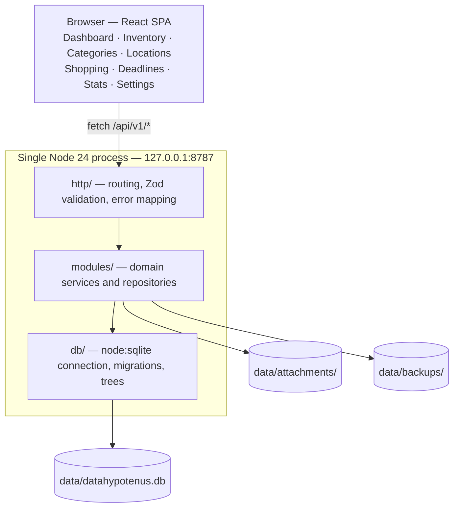

<div align="center">


# DataHypotenus

**The personal database of your home** — what you own, where it is, what it cost,
whether it is still under warranty, which documents belong to it, and what is still missing.

Local-first. Offline. No cloud, no account, no telemetry.<br>
One Node process, one SQLite file, one folder you can copy to another machine.

<p>
  
  
  
  
  
  
</p>

</div>

---

## Overview

DataHypotenus is a self-hosted home inventory system. It answers the questions that are
surprisingly hard to answer about your own house: *where did I put the spare router?*,
*is the dishwasher still covered?*, *how much did I spend on the kitchen last year?*,
*do we need coffee filters?*

It is deliberately small. The backend is a single Node process; the database is a single
SQLite file; every byte of user data lives in one directory that can be moved with `cp -r`.
There is no build step for the server, no native module to compile, no container to
orchestrate, and nothing that phones home.

The design target is a machine that runs unattended for years in a home — today a desktop PC,
tomorrow a Linux mini-PC on the LAN — and survives a hardware change by copying a folder.

## Design principles

| Principle | How it shows up in the code |
|---|---|
| **The data outlives the app** | Plain SQLite plus plain files. Readable with `sqlite3` or DB Browser, with or without this project. |
| **One process, one port** | The same Fastify instance serves `/api/v1`, the attachment blobs and the compiled SPA. |
| **No runtime dependency on the network** | Fonts, CSS and icons are bundled at build time. Normal operation makes zero outbound requests. |
| **Boring, native primitives** | Node 24 runs TypeScript directly and ships SQLite in core (`node:sqlite`) — no transpiler, no ORM, no driver to rebuild after an upgrade. |
| **Deletion is never silent data loss** | Items go to a trash bin; deleting a category or location promotes its children instead of destroying them. |
| **Strict layering** | Routes never contain SQL; services never know that Fastify exists. |

## Features

**Inventory**

- Items with quantity and unit of measure, purchase price, vendor, brand, serial number and barcode
- Consumables with a minimum-stock threshold and automatic restock into the shopping list
- Soft delete with trash, restore, permanent purge, and one-click duplication
- Per-item event history, recorded automatically on every change
- A stable public `uid` alongside the numeric key, resolvable via `GET /items/uid/:uid` — the hook for QR labels

**Two independent hierarchies**

- **Categories**: what a thing *is*
- **Locations**: where a thing *is* — room → furniture → shelf → container, with typed nodes
- Both support create, rename, move and delete; a non-cascading delete lifts children one level up

**Search and daily use**

- Full-text search (SQLite FTS5) spanning items plus their categories, locations, tags and vendors
- Around thirty composable filters: warranty state, price range, below-threshold stock, missing category, trash scope, and more
- Filter and sort state lives in the URL, so any view is bookmarkable and shareable
- Global command palette (<kbd>Ctrl</kbd> + <kbd>K</kbd>), plus `/` to search and `N` to create
- Row-level quick actions and bulk actions over a selection: move, categorize, set status, tag, delete, restore

**Documents and deadlines**

- Drag-and-drop photos and PDFs; attachment kinds: photo, receipt, invoice, manual, warranty
- Content-addressed blob store with SHA-256 deduplication — the same receipt attached twice is stored once
- Warranty end dates computed from purchase date plus warranty months; generic expiration dates with alerts
- A dashboard that is actionable rather than decorative: to buy, low stock, expiring warranties, upcoming expirations, recent additions, spend

**Data safety**

- Full backups (database + attachments + manifest), SHA-256 verification, automatic rotation
- Restore takes a safety backup first and supports a dry run
- CSV and JSON export/import with idempotent merge by `uid` — re-importing an export duplicates nothing
- Storage integrity check and garbage collection of orphaned blobs

**Analytics**

- Inventory value; spend by category, room, vendor and status
- Monthly spend series and highest-value items

## Architecture



Each layer has an explicit contract, and violations are visible by eye — a `SELECT` inside a
route file means something landed in the wrong place:

| Layer | May | May not |
|---|---|---|
| `http/routes` | Validate input, call services, shape responses | Write SQL, hold domain rules |
| `modules/*.service` | Apply rules, orchestrate, throw `AppError` | Know about Fastify, requests or responses |
| `modules/items.repository` | Write SQL | Hold domain rules |
| `db/` | Open the connection, run migrations | Know about the domain |
| `web/pages` | Compose the interface | Hold domain logic — that lives in `lib/` |

Full detail, including the end-to-end trace of a single request, is in
[docs/ARCHITECTURE.md](docs/ARCHITECTURE.md); the reasoning behind each choice is recorded as
numbered decisions in [docs/DECISIONS.md](docs/DECISIONS.md).

### Stack

| Concern | Choice |
|---|---|
| Runtime | Node.js 24 — native TypeScript execution, no server build step |
| HTTP | Fastify 5 with `@fastify/cors`, `@fastify/multipart`, `@fastify/static` |
| Validation | Zod 4 at the edge; only validated data travels past the route layer |
| Database | `node:sqlite` with WAL, enforced foreign keys, prepared statements, FTS5 |
| Migrations | Versioned SQL files with checksum verification |
| Frontend | React 19, Vite 8, React Router 7, TanStack Query 5 |
| Interface | Tailwind CSS 4, shadcn/ui on Radix primitives, Motion, OKLCH design tokens |
| Tests | `node:test` — no external test runner |

## Requirements

- **Node.js 24 or newer** (`node --version`). Version 24 is a hard requirement: the server relies
  on two native capabilities — direct TypeScript execution and the built-in `node:sqlite` module.
- Nothing else. No database server to install, no Docker, no native compilation.

## Quick start

```bash
git clone https://github.com/lucabresciani/DataHypotenus.git
cd DataHypotenus
npm install

npm run build     # type-checks server and web, compiles the interface into web/dist
npm start         # starts the application
```

Then open **<http://127.0.0.1:8787>**.

The first run creates `data/`, applies the migrations and seeds a starter set of categories and
locations. Tailwind, shadcn/ui and the Geist typeface are build-time dependencies only: once
compiled, the application makes no outbound requests.

### Development

```bash
npm run dev       # API on :8787, Vite dev server on :5173, both hot-reloading
```

Then open **<http://localhost:5173>**.

### Windows: one-click launch

`avvia datahypotenus.cmd`, wired to a desktop shortcut, starts the server if it is not already
running, waits until it actually answers, and opens the browser — double-clicking it twice will
not start a second server. The server then lives in a minimized window titled *datahypotenus*;
closing that window shuts the application down, as does `npm run ferma`.

To recreate the shortcut after moving the project:

```powershell
$s = (New-Object -ComObject WScript.Shell).CreateShortcut("$([Environment]::GetFolderPath('Desktop'))\datahypotenus.lnk")
$s.TargetPath = "$PWD\avvia datahypotenus.cmd"; $s.WorkingDirectory = "$PWD"
$s.IconLocation = "$PWD\assets\datahypotenus.ico,0"; $s.WindowStyle = 7; $s.Save()
```

## Command reference

| Command | What it does |
|---|---|
| `npm run avvia` | Starts the server if needed and opens the browser — what the desktop icon does |
| `npm run ferma` | Stops the server and closes its window |
| `npm run dev` | Backend and frontend in development mode, with hot reload |
| `npm run build` | Type-checks server and web, compiles the interface into `web/dist` |
| `npm start` | Runs the application against the compiled interface |
| `npm test` | Runs the server test suite |
| `npm run typecheck` | Type-checks both workspaces |
| `npm run migrate` | Applies pending migrations and lists the applied ones |
| `npm run seed` | Inserts the starter categories and locations |

Command-line flags are passed through the `server` workspace:

```bash
npm run seed   --workspace server -- --force            # re-seed even if data already exists
npm run backup --workspace server                       # create a backup
npm run backup --workspace server -- --list             # list backups with integrity status
npm run backup --workspace server -- --verify <name>    # verify one backup (SHA-256)
npm run backup --workspace server -- --restore <name>   # restore, taking a safety backup first
npm run gc     --workspace server -- --check            # report on the file store
npm run gc     --workspace server                       # delete unreferenced blobs
```

> [!NOTE]
> Use the `--workspace server -- <flag>` form whenever you pass arguments. Running
> `npm run backup -- --list` from the repository root does not forward the flag through the
> workspace indirection: npm swallows it and a new backup is created instead of a listing.

## Project layout

```
DataHypotenus/
├── avvia datahypotenus.cmd   Windows launcher — starts everything, opens the browser
├── server/                   backend: API, domain, database
│   ├── src/
│   │   ├── index.ts          entry point, graceful shutdown
│   │   ├── config.ts         configuration: paths, port, logging
│   │   ├── bootstrap.ts      startup: directories → connection → migrations → seed
│   │   ├── core/             errors, logging, dates, ids, CSV
│   │   ├── db/               connection, SQL migrations, tree helpers, seed
│   │   ├── modules/          one module per area: items, categories, locations,
│   │   │                     tags, statuses, vendors, attachments, shopping,
│   │   │                     dashboard, stats, backup, transfer, settings
│   │   ├── http/             HTTP server, validation, routes
│   │   └── cli/              command-line utilities
│   └── test/                 test suite (node --test)
├── web/                      React frontend
│   └── src/
│       ├── lib/              API client, types, formatting, theming
│       ├── components/       layout, forms, rows, shared patterns
│       │   └── ui/           shadcn/ui primitives (vendored source, not node_modules)
│       ├── pages/            one page per section
│       └── styles/           theme.css — OKLCH tokens and base rules
├── docs/                     project documentation (see below)
├── assets/                   logo and Windows icon
├── scripts/                  start, stop and development helpers
└── data/                     ALL user data (created on first run, never versioned)
    ├── datahypotenus.db      SQLite database
    ├── attachments/          photos and documents
    ├── backups/              full backups
    └── logs/                 application logs
```

## Configuration

Deployment settings come from environment variables, or from a `.env` file at the repository
root — copy [`.env.example`](.env.example) to start. Every value has a sensible default.

| Variable | Default | Description |
|---|---|---|
| `DH_DATA_DIR` | `./data` | Directory holding database, attachments, backups and logs. Relative to the project root, or absolute |
| `DH_HOST` | `127.0.0.1` | Listen interface. `0.0.0.0` exposes the application to the local network |
| `DH_PORT` | `8787` | HTTP port |
| `DH_CORS_ORIGINS` | *(empty)* | Extra allowed browser origins, comma-separated. The Vite dev server is already allowed |
| `DH_LOG_LEVEL` | `info` | `debug` \| `info` \| `warn` \| `error` |
| `DH_MAX_UPLOAD_MB` | `50` | Maximum size of a single attachment |
| `DH_AUTO_BACKUP_HOURS` | `24` | Back up on startup if the last backup is older than N hours. `0` disables it |
| `DH_BACKUP_KEEP` | `10` | How many backups to retain; older ones are pruned |

Usage preferences — currency, alert thresholds, page size — live in the database instead, under
*Settings*, so that they travel with the data. Both layers are documented in
[docs/CONFIGURATION.md](docs/CONFIGURATION.md).

## Where your data lives

Everything is under `data/`. Moving the application to another machine is a folder copy; putting
the data on a different disk is one environment variable, `DH_DATA_DIR`.

The database is an ordinary SQLite file with an ordinary schema — no proprietary encoding, no
opaque blobs stuffed into columns. Attachments are ordinary files on disk, addressed by content
hash. If this project disappeared tomorrow, the data would still open in any SQLite tool.

## HTTP API

Base URL `http://127.0.0.1:8787/api/v1`. JSON in, JSON out, with a single error envelope:

```jsonc
{
  "error": {
    "code": "validation_error",       // not_found | conflict | bad_request | internal_error …
    "message": "Check the submitted data",
    "details": [{ "field": "name", "message": "Name is required" }]
  }
}
```

| Area | Endpoints |
|---|---|
| Diagnostics | `GET /health` — status, schema version, integrity check, resolved paths |
| Items | CRUD plus `restore`, `duplicate`, `quantity`, `restock`, `history`, `attachments`, `uid/:uid`, `bulk`, `trash/empty` |
| Taxonomy | `/categories`, `/locations` (with `/tree` and `/:id/contents`), `/tags`, `/statuses`, `/vendors`, `/settings` |
| Attachments | Multipart upload, metadata, file streaming, `storage/check`, `storage/gc` |
| Shopping | CRUD plus `convert` — turns a shopping line into an inventory item |
| Overview | `GET /dashboard`, statistics, CSV and JSON export/import |

The complete reference, including the full `/items` filter set and the bulk-action payloads, is
in [docs/API.md](docs/API.md).

## Testing and quality

```bash
npm test          # 98 tests, 24 suites — node:test, no external runner
npm run typecheck # strict TypeScript across server and web
```

Coverage targets the places where silent corruption would be expensive: migrations, tree
mutations, transfers, storage integrity, statistics, shopping conversion and CSV/JSON
round-trips. The interface is responsive, ships light and dark themes, and honours
`prefers-reduced-motion`.

## Deployment

The intended production target is an always-on Linux mini-PC on the home network. Because the
application is one Node process and one data directory, deployment is `rsync` plus a systemd
unit — no native rebuild, no container. Step-by-step instructions, including LAN and firewall
considerations, are in [docs/DEPLOY-LINUX.md](docs/DEPLOY-LINUX.md).

## Security and privacy

- The server binds to **`127.0.0.1` only**. It is unreachable from the network until you
  explicitly decide otherwise (`DH_HOST=0.0.0.0`).
- No outbound requests during normal operation. No telemetry, no analytics, no account.
- No secrets in the source tree: deployment configuration comes from the environment or `.env`.
- **There is no authentication**, by design — it buys nothing for a process listening on
  loopback. Read [docs/DEPLOY-LINUX.md](docs/DEPLOY-LINUX.md) before exposing it on a LAN, and
  put it behind an authenticating reverse proxy if it must leave the machine.
- Uploads are size-capped (`DH_MAX_UPLOAD_MB`) and stored by content hash, outside the web root.

## Documentation

| Document | Contents |
|---|---|
| [docs/ARCHITECTURE.md](docs/ARCHITECTURE.md) | How the system is built and where each responsibility lives |
| [docs/DATABASE.md](docs/DATABASE.md) | Full schema, relationships, migrations |
| [docs/DECISIONS.md](docs/DECISIONS.md) | Architectural decisions, with rationale and rejected alternatives |
| [docs/CONFIGURATION.md](docs/CONFIGURATION.md) | Environment variables and in-app settings |
| [docs/BACKUP.md](docs/BACKUP.md) | Backup, restore, integrity verification |
| [docs/IMPORT-EXPORT.md](docs/IMPORT-EXPORT.md) | CSV and JSON formats, import rules |
| [docs/API.md](docs/API.md) | HTTP endpoint reference |
| [docs/DEPLOY-LINUX.md](docs/DEPLOY-LINUX.md) | Moving to a Linux mini-PC, systemd service |
| [docs/ROADMAP.md](docs/ROADMAP.md) | Feature status and what comes next |

> [!NOTE]
> The application interface and the documents under `docs/` are written in Italian. The code,
> the API and this README are in English.

## Roadmap

The feature set above is complete and in daily use. Planned next, in order of practical value:
maintenance records (the `maintenance_records` table already exists and only lacks an
interface), printable QR labels for boxes, depreciation and current value, loan tracking, a
global activity view, optional weekly notification digests, and LAN access with authentication.
Detail and rationale in [docs/ROADMAP.md](docs/ROADMAP.md).

## License

MIT.
